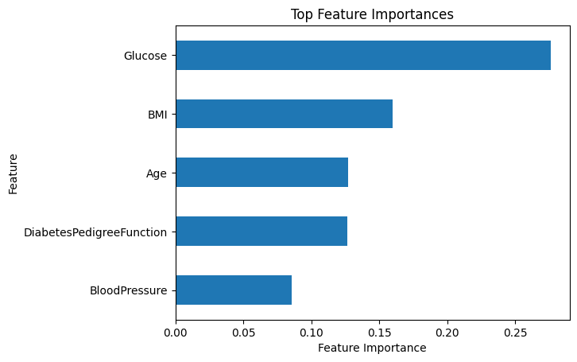

> # <h1 align="center">Project 2 **Diabetes Patients**</h1>

> 
>> ## **[Data Analytics](https://github.com/AhmedNasser1601/Data-Analytics) Internship**
>>> ### **[ahmednasser1601@gmail.com](mailto:ahmednasser1601@gmail.com)**

> **Objective:** <code>Diagnostically predict whether a patient has diabetes based on certain diagnostic measurements included in the dataset.</code>

> <table align="center"><tr><td><a href="">LinkedIn Post</a></td><td><a href="Diabetes-Patients.ipynb">Notebook File</a></td><td><a href="Diabetes.csv">Dataset</a></td></tr></table>

> 
