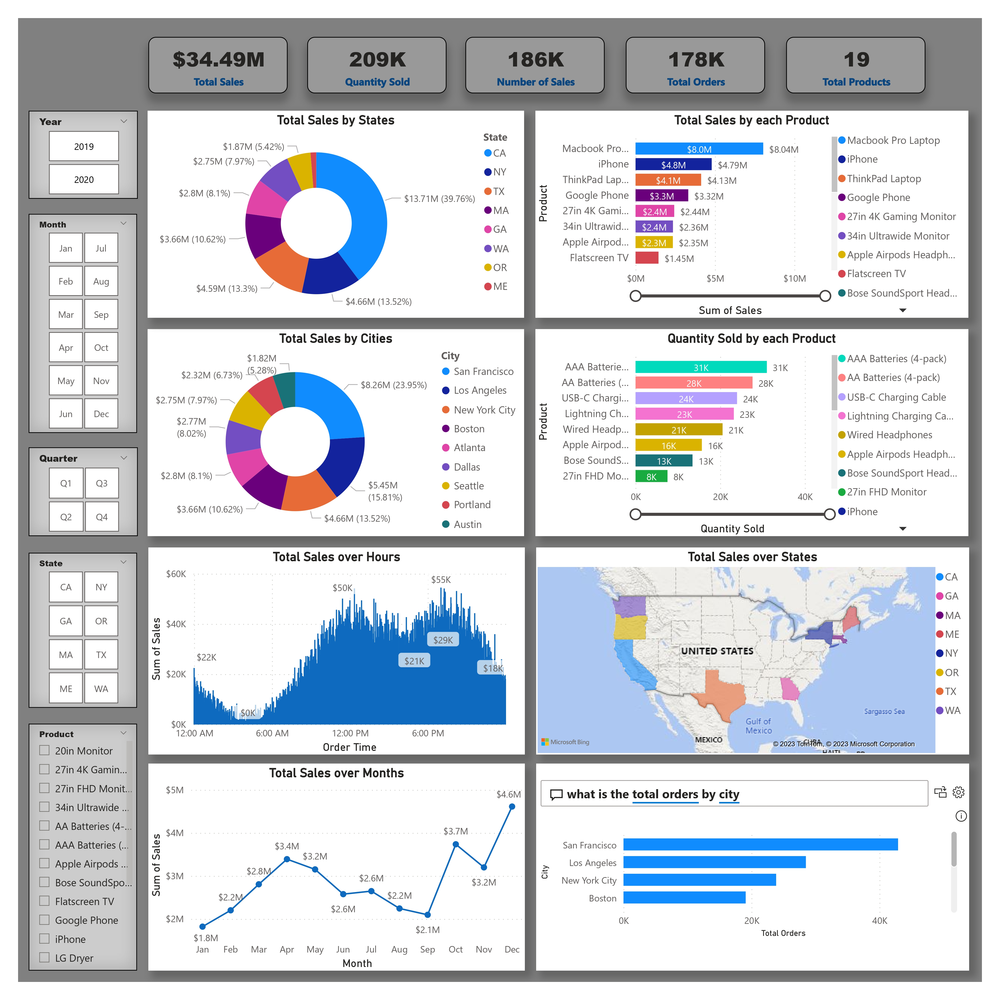

> <h1 align="center">Project 1 **Sales Data Analysis**</h1>

> 
>> ## **[Data Analytics](https://github.com/AhmedNasser1601/Data-Analytics) Internship**
>>> ### **[ahmednasser1601@gmail.com](mailto:ahmednasser1601@gmail.com)**

> **Objective:** <code>Analysis of sales data to identify trends, top-selling products, and revenue metrics for business decision-making.</code>

> <table align="center"><tr><td><a href="https://www.linkedin.com/posts/ahmednasser1601_1st-project-sales-data-analysis-activity-7106132142715236352-c_sJ?utm_source=share&utm_medium=member_desktop"><b>LinkedIn Post</b></a></td><td><a href="Sales-Data-Analysis.pbit"><b>PowerBI File</b></a></td><td><a href="Sales-Data.csv"><b>Dataset</b></a></td></tr></table>

> 
